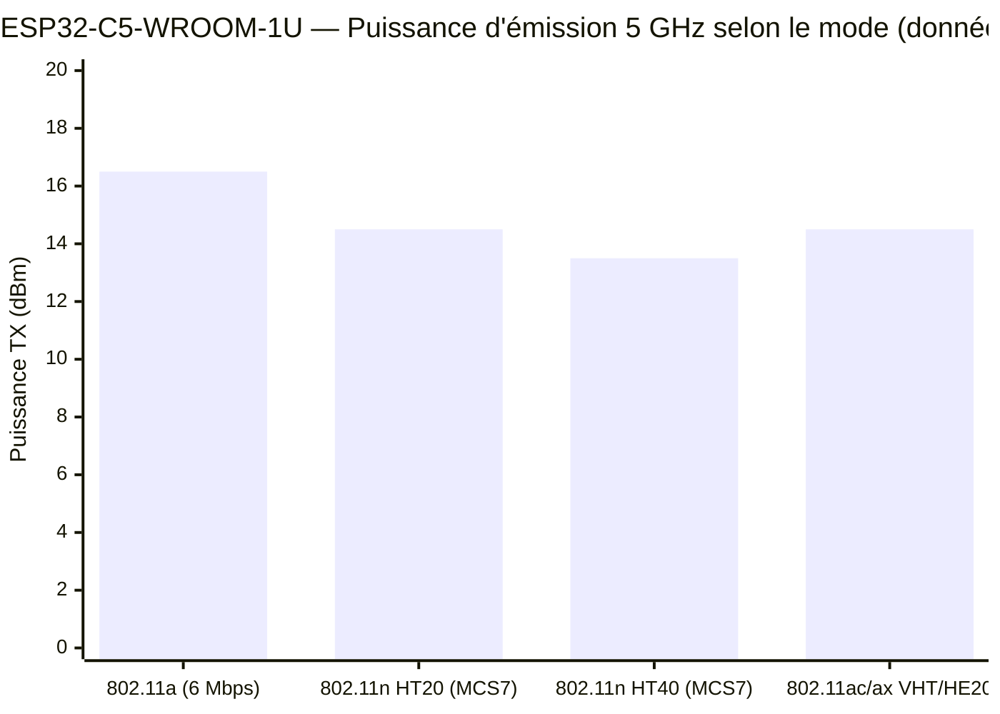
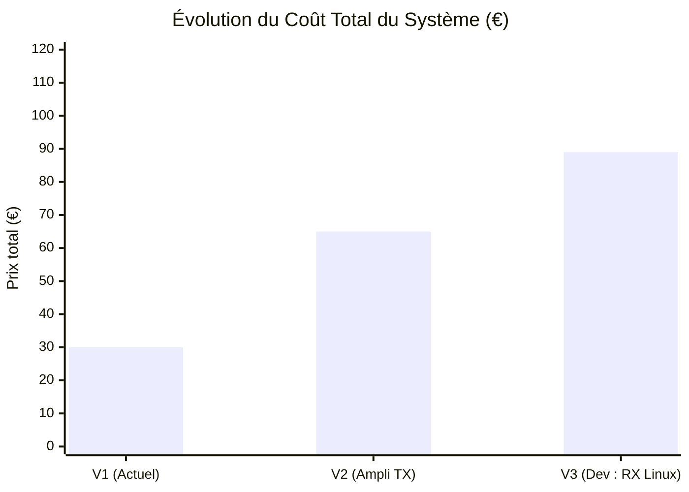
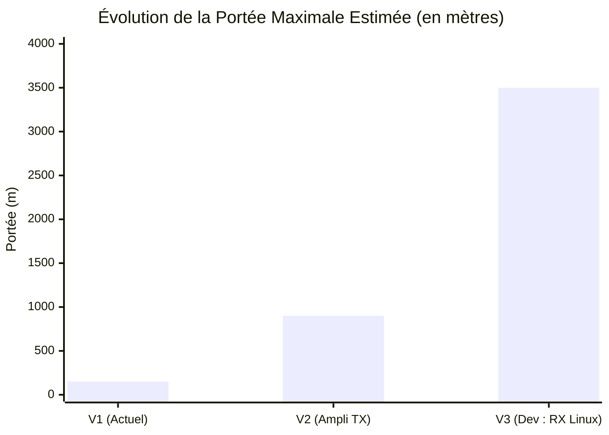
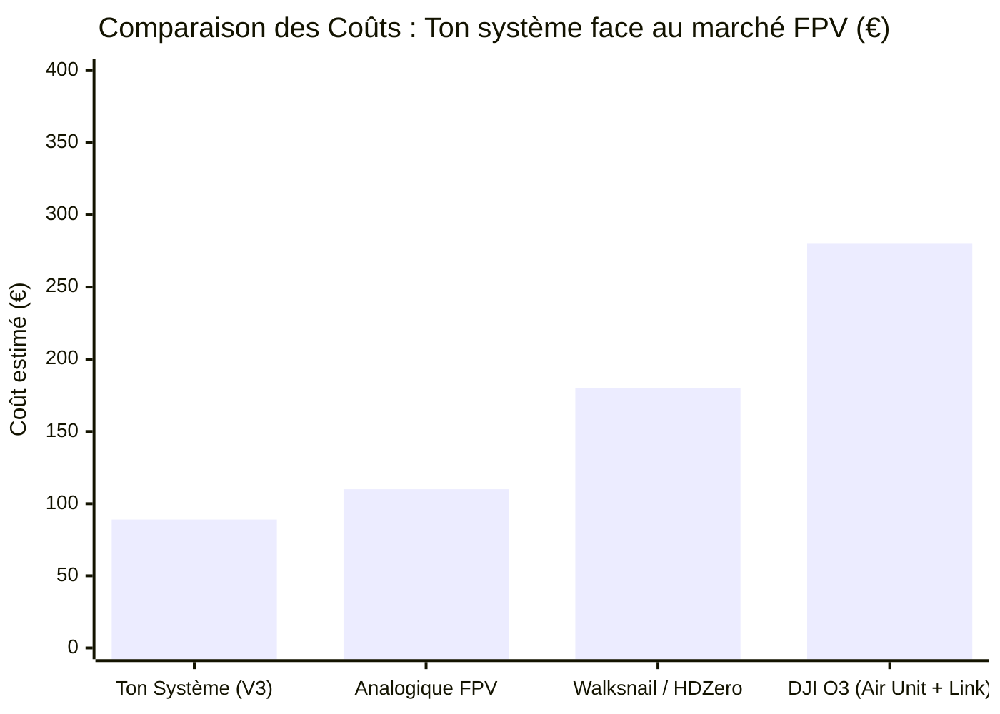
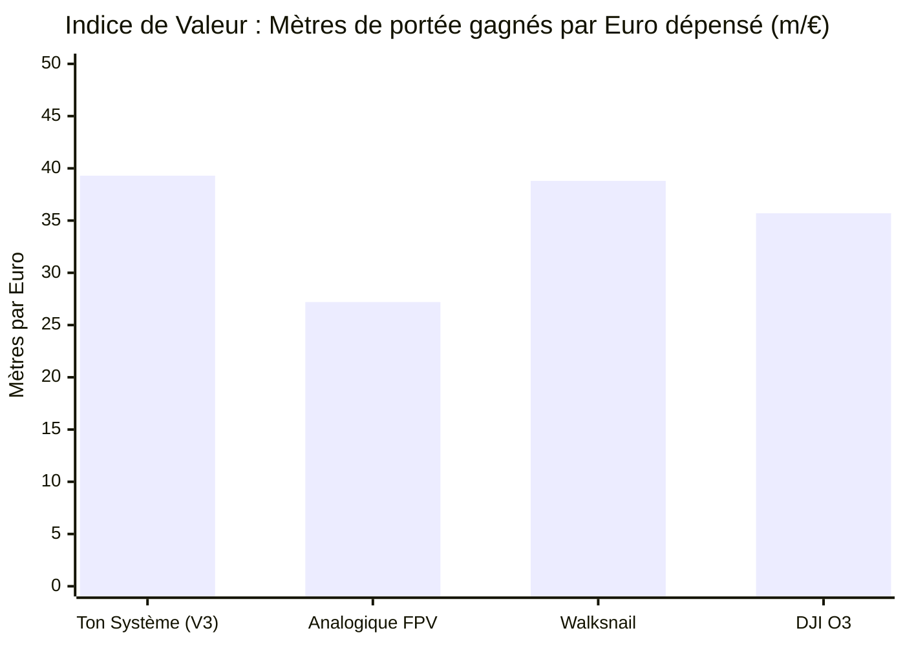

# 📡 Analyse et Évolution du Système de Transmission Wi-Fi (Projet FPV / Télémétrie)

Ce document détaille l'architecture actuelle de transmission basée sur un ESP32-C5, ainsi que ses évolutions prévues (V2 et V3) misant sur l'amplification de puissance et l'amélioration de la réception logicielle sous environnement Linux.

## 1. Référence Constructeur : Puissance d'émission de l'ESP32-C5

Avant d'analyser le système, voici les données constructeur brutes de la puce utilisée pour l'émission (TX), avec les accents corrigés.

*Note : 16.5 dBm correspond à environ 45 mW, et 13.5 dBm à environ 22 mW.*

---

## 2. Feuille de Route et Évolutions du Système

### V1 : Le Montage Actuel (Le PoC)
*   **TX :** ESP32-C5 WROOM-1U N8R8 + Antenne Lollipop (omnidirectionnelle). Puissance brute : ~15-16 dBm.
*   **RX :** Smartphone standard (antennes internes, aucune optimisation logicielle).
*   **Performances :** Signal limité par l'absorption des mains sur le téléphone et la faible sensibilité RX. Portée d'environ 150m en champ libre (LOS), très sensible aux obstacles (murs/arbres).
*   **Coût :** ~30€ (PCB/ESP32) + 0€ (Téléphone).

### V2 : Amélioration en Puissance Brute (Ampli TX)
L'objectif ici est de "forcer" le passage du signal à travers les obstacles et d'augmenter la portée sans changer le récepteur.
*   **Modification :** Ajout d'un amplificateur de signal Wi-Fi (Booster) entre l'ESP32 et l'antenne Lollipop.
*   **Spécifications :** Un ampli standard de 2 Watts fera passer la puissance d'émission de ~15 dBm à **+33 dBm**.
*   **Impact :** La pénétration à travers les murs, le feuillage et le béton est drastiquement améliorée grâce à la réserve de puissance. Même si un arbre absorbe 15 dBm de signal, il restera suffisamment d'énergie pour atteindre le téléphone.
*   **Coût ajouté :** ~35€ pour un module amplificateur 2W 5GHz/2.4GHz. (Total V2 : ~65€).
*   **Portée estimée :** ~800m à 1km (Le téléphone devient le goulot d'étranglement car il ne peut pas "répondre" assez fort pour les accusés de réception TCP, ce qui implique de privilégier un protocole UDP unidirectionnel).

### V3 : Piste d'Amélioration en Cours de Développement (RX Linux)
La prochaine grande étape logique est de remplacer le smartphone par un récepteur conçu pour capturer le moindre paquet de données.
*   **Nouveau RX :** PC/SBC sous Kali Linux + Clé Wi-Fi CHANEVE (Puce RTL8812AU) + 2 antennes externes 5 dBi.
*   **Impact :** Le mode *Monitor* de Linux (injection/réception brute) couplé à la sensibilité de la puce RTL8812AU (-90 à -95 dBm) permet de capter des signaux extrêmement faibles que le téléphone ignorerait.
*   **Coût ajouté :** ~24€ pour la clé réseau. (Total V3 : ~89€).
*   **Portée estimée :** > 3 kilomètres en champ libre, excellente pénétration en milieu boisé grâce à l'ampli TX + haute sensibilité RX.

---

## 3. Courbes d'Évolution (V1 vs V2 vs V3)

### Évolution de l'Investissement (Prix)

### Évolution des Performances (Portée LOS estimée)

---

## 4. Analyse du Marché FPV : Ton système vs Solutions Commerciales

Pour situer ce projet en tant que futur produit final par rapport à ce qui existe sur le marché du drone FPV et de la télémétrie :

*   **Ton Système (V3) :** Basé sur Wi-Fi brut/UDP (Type EZ-Wifibroadcast). Latence variable mais très faible coût, bidouillable.
*   **Analogique (5.8 GHz) :** VTX puissant + VRX classique. Latence quasi-nulle, dégradation avec de la neige (bruit), pas de HD.
*   **Walksnail Avatar / HDZero :** Solutions numériques dédiées FPV. Latence fixe, très bonne image.
*   **DJI O3 / O4 :** Le standard numérique haut de gamme. Portée colossale, image 4K, mais système totalement fermé et très cher.

### Comparaison : Coût d'un système complet (Émetteur + Récepteur)
*(Estimations pour le matériel de liaison uniquement, hors caméras)*

### Comparaison des Ratios Prix / Portée (Efficacité économique)
*(Plus la barre est haute, plus tu as de mètres de portée pour chaque euro investi)*

**Conclusion de l'analyse marché :**
Avec la **V3** (Amplificateur 2W + RTL8812AU sous Kali Linux), ton système se positionne comme **le leader en termes de ratio Prix/Performances** (~39 mètres de portée par euro investi). Il bat les systèmes commerciaux fermés (qui font payer cher leur interface utilisateur et leur compacité) tout en offrant une portée et une pénétration de signal (grâce à l'ampli de 2W) largement suffisantes pour des opérations longues distances en environnement obstrué.